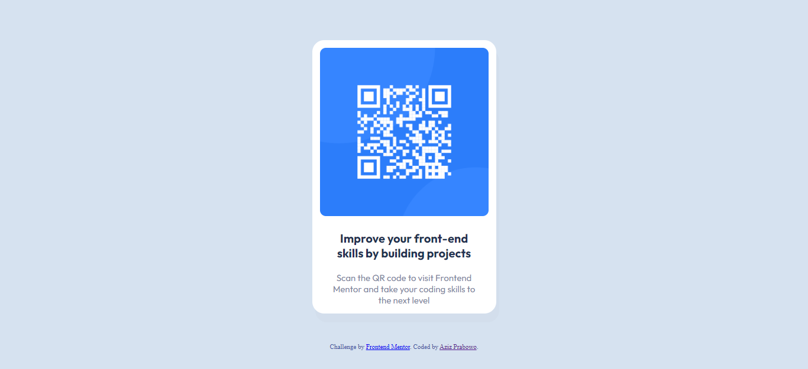

# Frontend Mentor - QR code component solution

This is a solution to the [QR code component challenge on Frontend Mentor](https://www.frontendmentor.io/challenges/qr-code-component-iux_sIO_H). Frontend Mentor challenges help you improve your coding skills by building realistic projects.

## Table of contents

- [Overview](#overview)
  - [Screenshot](#screenshot)
  - [Links](#links)
- [My process](#my-process)
  - [Built with](#built-with)
  - [What I learned](#what-i-learned)
  - [Continued development](#continued-development)
- [Author](#author)
- [Acknowledgments](#acknowledgments)

## Overview


### Screenshot



### Links

- Solution URL: [Add solution URL here](https://www.frontendmentor.io/challenges/qr-code-component-iux_sIO_H/hub/qr-code-component-1utkpYPOGZ/solutions)
- Live Site URL: [Add live site URL here](https://azizp128.github.io/QR-Code/)

## My process

### Built with

- Semantic HTML5 markup
- CSS custom properties
- Flexbox

### What I learned

I learned new properties such as min-width, box-shadow, and align-items. Most of the properties are from CSS Flexbox.

The code snippets are below:

```css
.container {
  display: flex;
  justify-content: center;
  align-items: center;
  flex-direction: column;
  min-width: 300px;
}
```

```css
.container .qr-code {
  width: 250px;
  border-radius: 10px;
  background-color: hsl(0, 0%, 99%);
  box-shadow: 50px;
  margin-top: 110px;
  display: flex;
  flex-wrap: wrap;
  justify-content: center;
  align-items: center;
}
```

### Continued development

I'm going to improve my Layout and Flexbox skills first and then move to learn about CSS Grid.

## Author

- Website - [Aziz Prabowo](https://azizp128.github.io/)
- Frontend Mentor - [@azizp128](https://www.frontendmentor.io/profile/azizp128)
- Twitter - [@azizprbw](https://www.twitter.com/azizprbw)

## Acknowledgments

Learn the basics first like Layout and Positioning and then you can move on to Flexbox, and CSS Grid.
